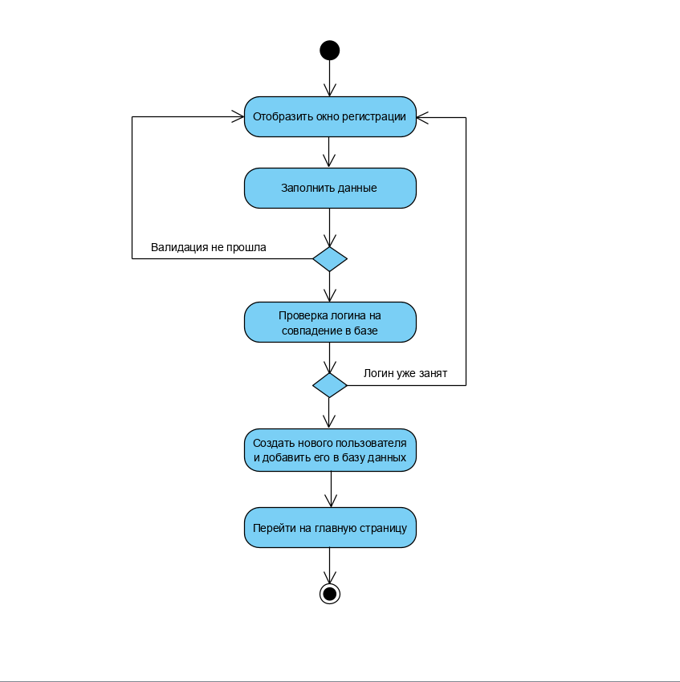
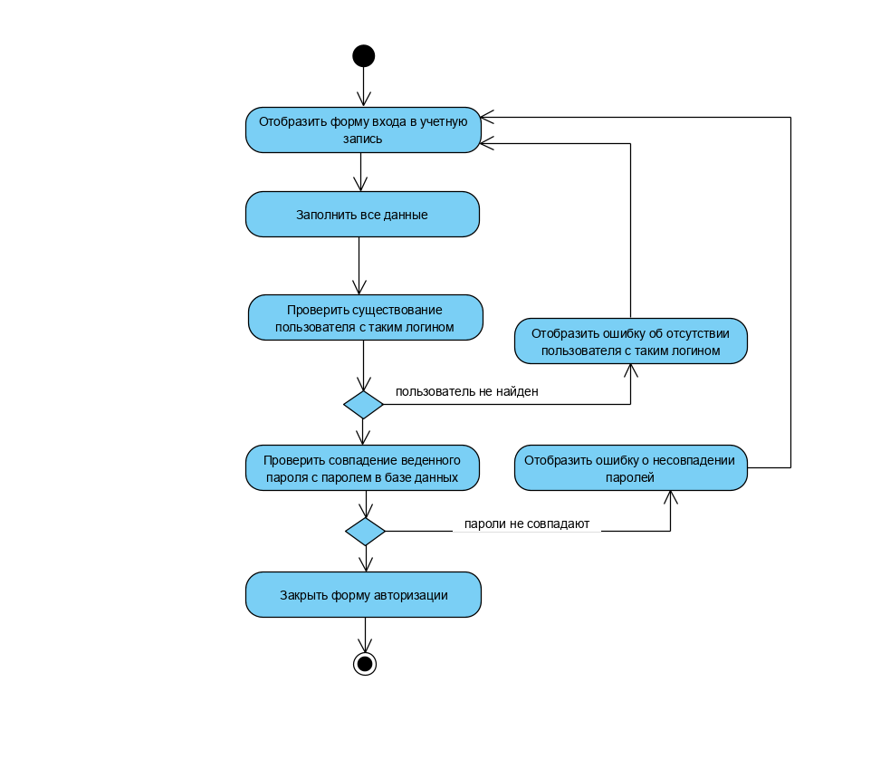
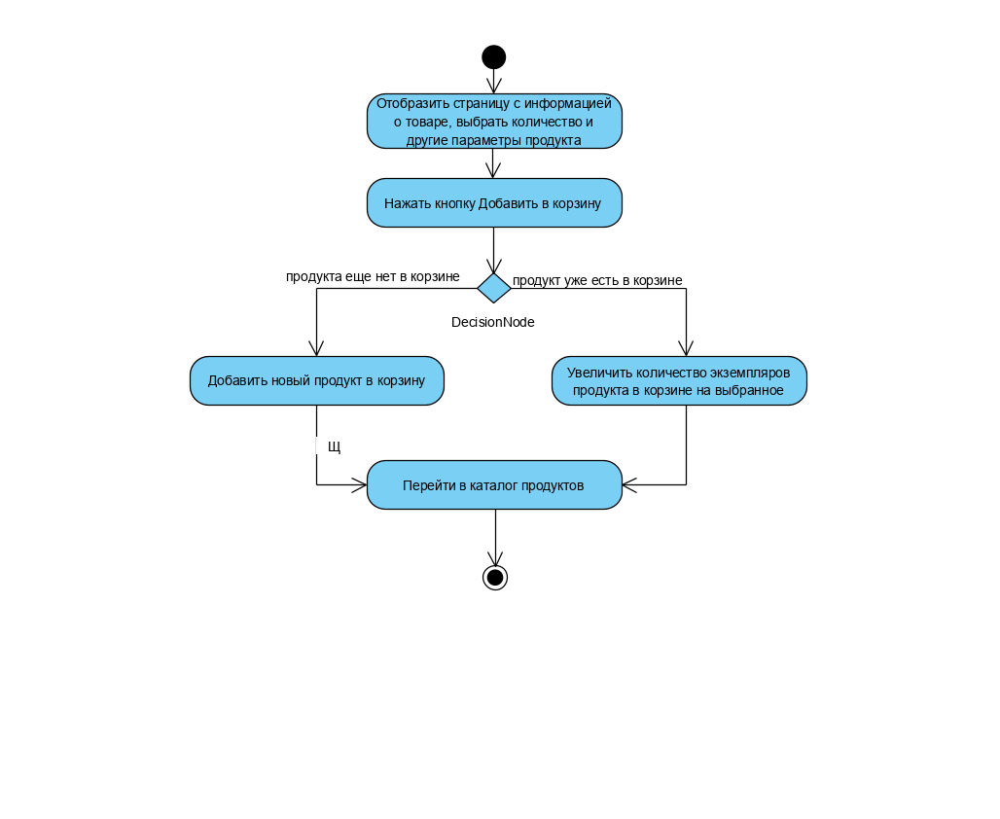
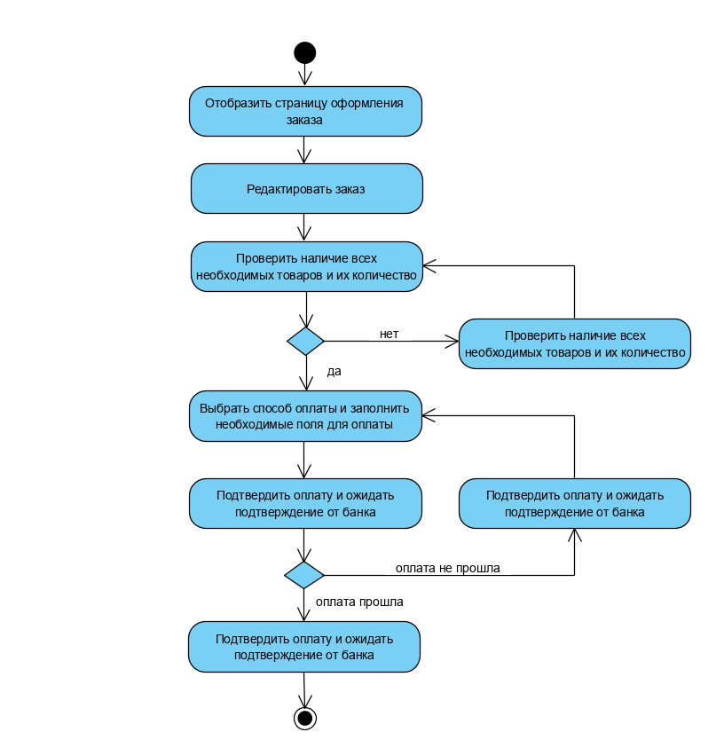

 Диаграммы активностей
---

## Содержание
1 [Зарегистрироваться](#reg)  

2 [Войти в учётную запись](#login)  

3 [Добавить продукт в корзину](#add) 

4 [Создать заказ](#createCart) 

<a name="reg"/>

## 1 Зарегистрироваться

<a name="login"/>

## 2 Войти в учётную запись

<a name="add"/>

## 3 Добавить продукт в корзину

<a name="createOrder"/>

## 4 Создать заказ
